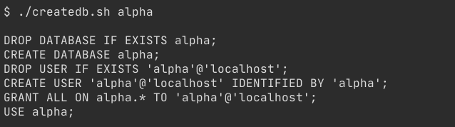
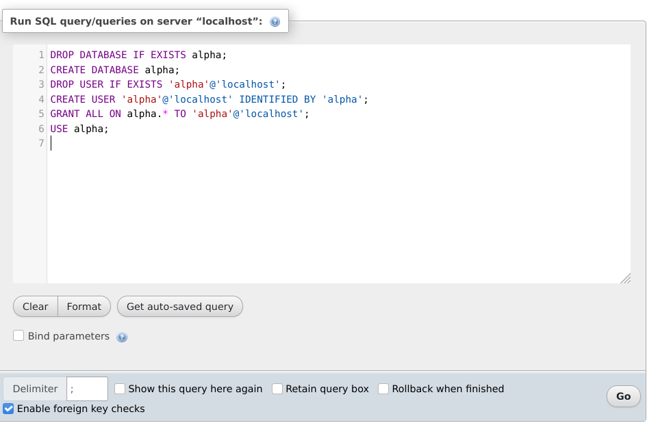

# Wordpress Database Generator

Bash script that generates SQL code that creates db, user and pass with
string that you pass as argument to 'createdb.sh'.
This is useful when you just want to quickly generate database for Wordpress development on local machine.

Generate sql code:    

Query code in phpMyAdmin:     

### Have Fun
